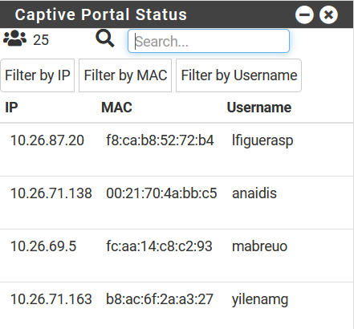

# witgetsPfsense
Widgets for the Pfsense dashboard

## Captive portal
The difference with the original witget is that the number of connected users is added, a search bar with buttons to filter by IP, MAC and user, also a stop was added to the witget

#### Replace the captive_portal_status.widget.php file
`cp captive_portal_status.widget.php /usr/local/www/witgets/witgets`

## Filter

